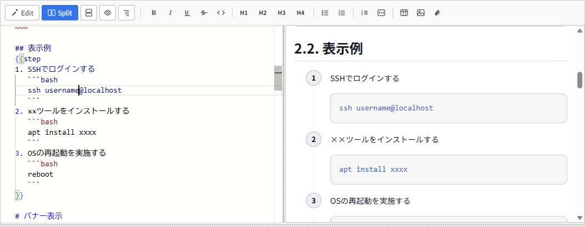

# Redmine Monaco Editor

**English** | [日本語](README.ja.md)

**A drop-in plugin that turns Redmine's somewhat clunky text editor into a VS Code-class writing experience.**

Ever wished Redmine's ticket and wiki editor were a little easier to write in? This plugin replaces Redmine's default textarea with the [Monaco Editor](https://microsoft.github.io/monaco-editor/) (the engine that powers VS Code). You get syntax highlighting, live preview, an outline view, and more — making long procedures and design notes far more comfortable to write.



It never connects to any external CDN or API. Monaco itself is bundled inside the plugin, so **it works as-is in closed environments with no internet access (on-premise / internal networks).**

## Features

**VS Code syntax highlighting**
Markdown is highlighted, and so is the content inside code blocks, colored per language. Major languages such as bash, SQL, Python, Go, Rust, and YAML are supported, so commands and code pasted into procedures stay readable.

**Four view modes**
Switch between "edit only", "editor + preview side by side", "stacked (top/bottom)", and "preview only" with a single click. Split mode is handy when you want to check the result as you write. The preview is rendered with the same look as Redmine's native preview (section numbers, theme styling, etc.).

**Free resizing**
Both the editor height and the boundary between split panes can be dragged to any size you like.

**Scroll sync**
In split mode, scrolling the editor moves the preview to the corresponding position. You won't lose track of where you are, even in long documents.

**Outline panel**
Show a list of headings in a side panel. The hierarchy is expressed with indentation, and clicking a heading jumps to it. Great for grasping the structure of a long wiki page or quickly moving to a target section.

**Ticket number tooltips**
Hover over a ticket reference such as `#1010` or `#89-3` and a tooltip gently shows that ticket's information. You can check the content without opening the link.

**@mention completion**
Type `@` to bring up project member candidates. Fuzzy matching is supported, and even if you pick by display name it is inserted in the login-ID form (`@login`) that Redmine recognizes, so you can enter mentions accurately and quickly. Hovering over a confirmed mention shows that person's info in a tooltip.

**Formatting toolbar**
Insert bold, italic, underline, strikethrough, inline code, headings (H1–H4), bulleted lists, numbered lists, quotes, and code blocks from buttons. They work both by wrapping a selection and by inserting at the cursor. Keyboard shortcuts `Ctrl+B` (bold) and `Ctrl+I` (italic) are supported as well.

**Table grid insertion**
Click the table button and a grid appears; just pick the rows × columns with your mouse (like "3×4") to insert a table skeleton. You can start building tables with an Excel/Word-like feel.

**Table builder (Excel-like editing)**
Next to the table button, the "table builder" button opens an Excel-like table editor in a separate tab from the body. You can type directly into cells (IME input works from the first character), add/remove rows and columns, select and reorder by dragging, rename columns by double-clicking the header, sort by column, and paste from Excel or Markdown tables. Insert the finished table into the body with the "Insert as Markdown" / "Insert as Textile" buttons. Use the "Body" tab to return to editing, "+" to add tables, and "×" to close them. Multiple tables can be edited in parallel.

**Edit existing tables in place**
For tables already written in the body, click the table icon that appears at the left of the first row (next to the line gutter) to load it into the table builder. After editing, press "Update" and the original table is rewritten in place. Markdown stays Markdown and Textile stays Textile, so the syntax is never changed unexpectedly. No more lining up `|` characters by hand.

**Cell and header styling (Textile mode only)**
When the ticket format is Textile, the right-click menu in the table builder offers "Set color", "Make bold", and "Make italic". You can apply them to data cells or column headers, and they affect the whole selection at once. Colors come from an 8-color preset palette (soft red, yellow, green, blue, etc.), and "Custom color" lets you pick any color. Styles are saved using the standard Textile syntax (`|{background:#fee}. text |` / `*bold*` / `_italic_`), so they show up in the Redmine display as expected. Since Markdown has no standard syntax for cell styling, this feature is shown only for Textile tickets.

**Image insertion**
Pick an image attached to the ticket/wiki from a thumbnail list and insert it. Images that were just uploaded but not yet saved also appear as candidates. When duplicate file names exist, the newer one takes precedence, and hovering shows the date.

**File link insertion**
Insert a link to an attachment (`attachment:filename`) by picking it from a list. Each file type — Excel, Word, PDF, PowerPoint, image, code, config file, and more — gets its own icon so you can tell them apart at a glance. Hovering shows the file name, description, and date.

**Macro completion**
Type `{{` to bring up the macros available in your Redmine. In addition to built-in macros like `toc`, `include`, `collapse`, and `thumbnail`, macros added by other plugins (DMSF, drawio, etc.) also appear automatically. Selecting a candidate shows the macro's description on the side, so you won't get stuck on argument syntax. You can also trigger it from the "Insert macro" toolbar button.

**Wiki link completion**
Type `[[` to bring up the wiki pages you can view. Pages in other projects are completed in the `[[project-identifier:page-name]]` form automatically. Wiki pages are also suggested inside the parentheses of macros that take a page name, such as `{{include(` and `{{child_pages(`. You can also trigger it from the "Insert wiki link" toolbar button.

**Thumbnail zoom in preview**
Thumbnails inserted with `{{thumbnail}}` can be clicked in the preview to zoom in place. It does not navigate to the original image page, so you can check the image larger while keeping your work. Close it with a background click, the × button, or the ESC key.

**Markdown and Textile support**
Works whether Redmine is set to Markdown or Textile. The toolbar buttons automatically emit the correct markup for the active format, so you get the same operation feel in either environment.

**Per-user on/off**
For people who prefer the familiar standard editor, each user can choose whether to use Monaco Editor from their own "My account" preferences page. When turned off, Monaco is not loaded for that user and Redmine's standard editor is shown as usual.

**Selectable themes**
Each user can pick an editor theme from their "My account" preferences: GitHub Light, Quiet Light (both light), or GitHub Dark (night mode). The choice is per-user, so everyone can use the look they prefer.

**Adjustable font size**
Each user can also choose the editor font size from their "My account" preferences. Like the other options, it is saved per-user.

**Fullscreen mode**
A fullscreen button sits at the top-right of the editor toolbar. Click it to expand just the editor to fill the whole screen, so you can focus on writing long documents. Press the button again or hit ESC to return to normal.

## Tested environment

- Redmine 6.1 (Propshaft environment)
- Text formatting: both Markdown and Textile are supported (select under "Administration > Settings > General")
- UI language: Japanese and English (follows the Redmine per-user language setting automatically)
- Bundled Monaco Editor: v0.52.0 (shipped with the plugin; works fully offline)

## Directory layout

```
redmine_monaco_editor/
├── init.rb                          # Plugin registration + ViewHook (injects the i18n dictionary)
├── app/
│   └── controllers/
│       ├── monaco_macros_controller.rb     # Macro list API (for {{ completion)
│       ├── monaco_wiki_pages_controller.rb # Wiki page list API (for [[ completion)
│       └── monaco_users_controller.rb      # Member list API (for @ completion)
├── config/
│   ├── routes.rb                    # Routes for the APIs above (/monaco_editor/...)
│   └── locales/
│       ├── en.yml                   # UI strings (English)
│       └── ja.yml                   # UI strings (Japanese)
├── assets/
│   ├── javascripts/monaco_editor.js # Main script
│   └── stylesheets/monaco_editor.css
├── public_dist/
│   ├── vs/                          # Monaco itself
│   └── table-builder/               # Table builder (ESM module)
├── LICENSE
└── README.md
```

## Installation

### Step 1: Place the plugin

Put the `redmine_monaco_editor` directory under Redmine's `plugins/`.

```
<REDMINE_ROOT>/plugins/redmine_monaco_editor/
```

### Step 2: Place Monaco (vs/) directly under public/ ★IMPORTANT★

This is the key step of this plugin. **Copy the contents of `public_dist/` to Redmine's `public/monaco_assets/`.** Both `vs/` (Monaco) and `table-builder/` (table builder) must be served with plain paths under `/monaco_assets/`.

```bash
mkdir -p <REDMINE_ROOT>/public/monaco_assets
cp -r <REDMINE_ROOT>/plugins/redmine_monaco_editor/public_dist/. \
      <REDMINE_ROOT>/public/monaco_assets/
```

> Note: the trailing dot in `public_dist/.` places `vs/` and `table-builder/` directly under `monaco_assets/`. Without the dot you would get an extra `monaco_assets/public_dist/...` level.

After placing it, you're good if the following file exists:

```
<REDMINE_ROOT>/public/monaco_assets/vs/loader.js
<REDMINE_ROOT>/public/monaco_assets/table-builder/index.js
```

### Step 3: Restart Redmine

Restart your web server (Puma / Passenger, etc.).

### Verify

Open a ticket or wiki edit screen in your browser; if the editor has changed to Monaco, it worked. You can also confirm by accessing `<host>/monaco_assets/vs/loader.js` directly and getting a 200 response.

## Why place it under public/ (technical background)

You might think "Step 2 is a bit of a hassle," but there's a reason rooted in Redmine 6.

Redmine 6's asset pipeline (Propshaft) serves assets only via hashed URLs (`/assets/....-<hash>.js`). Monaco Editor, on the other hand, is designed to **dynamically load many sub-files via plain paths (no hash)** starting from `vs/loader.js` (e.g. `vs/editor/...`). So if placed under Propshaft management, those plain paths return 404 and it won't work.

That's why only `vs/` is placed directly under `public/`. Files under public are served statically by Rails with their plain paths (bypassing Propshaft), so Monaco's loader works correctly.

- `monaco_editor.js` / `monaco_editor.css` … normal plugin assets (served by Redmine via `javascript_include_tag` / `stylesheet_link_tag`)
- `vs/` … placed at `public/monaco_assets/vs/` and served with plain paths (`/monaco_assets/vs/...`)
- `table-builder/` … placed at `public/monaco_assets/table-builder/` and served with plain paths (`/monaco_assets/table-builder/index.js`)

The JS side is hard-configured to reference `/monaco_assets/vs` (see `getMonacoBase()` in `monaco_editor.js`). If you want to change the placement, update this function's return value accordingly.

## Automating the copy on every update

The Step 2 copy needs to be done each time you update the plugin. Depending on your environment, integrating it into the startup process removes the need to copy manually.

### Docker (official redmine image, etc.)

In setups where `public/` is reset on container start, add the copy step to your entrypoint script.

```bash
# Example: run before the server starts (exec) inside the entrypoint
src="plugins/redmine_monaco_editor/public_dist"
dest="public/monaco_assets"
if [ -d "$src" ]; then
    rm -rf "$dest"
    mkdir -p "$dest"
    cp -r "$src"/. "$dest"/
fi
```

Because it's wrapped in `if [ -d "$src" ]`, removing this plugin won't affect startup (if the source doesn't exist, it does nothing).

### Non-Docker (Passenger / Puma in place, etc.)

`public/monaco_assets/vs/` persists once copied, so you only need to run Step 2 once. When you update the plugin, run Step 2 again to replace `vs/`.

A symlink works too (if your web server can serve symlink targets).

```bash
ln -s <REDMINE_ROOT>/plugins/redmine_monaco_editor/public_dist \
      <REDMINE_ROOT>/public/monaco_assets
```

## Uninstall

1. Remove `plugins/redmine_monaco_editor/`
2. Remove `public/monaco_assets/`
3. Restart Redmine

You'll be back to the default editor.

## License

This plugin is released under the MIT License. See [LICENSE](LICENSE) for details.

Note that the Monaco Editor bundled under `public_dist/vs/` is a separate work by Microsoft under its own license (the MIT License). The copyright and license of Monaco Editor belong to Microsoft.
